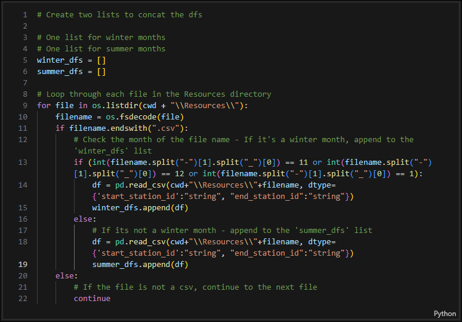
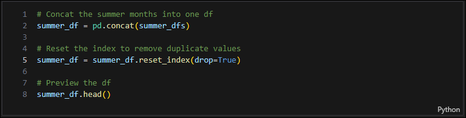
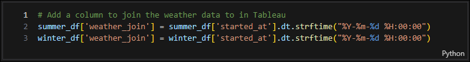
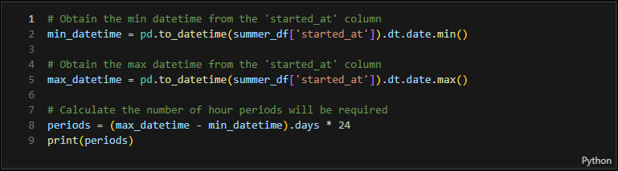
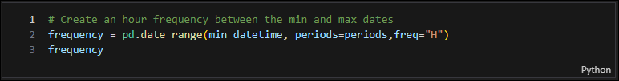
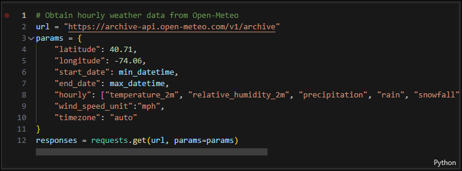
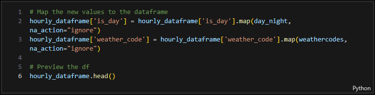
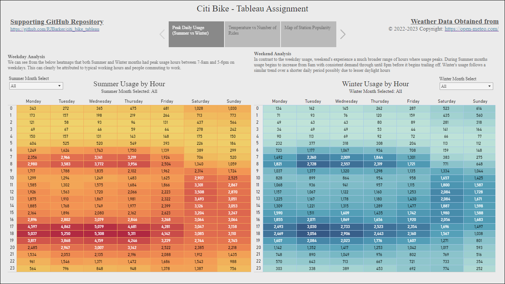
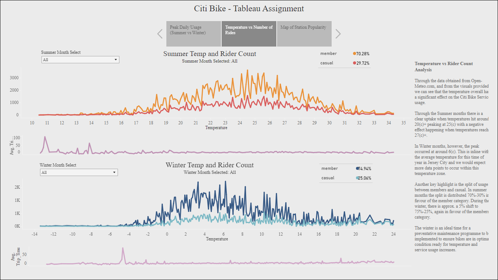
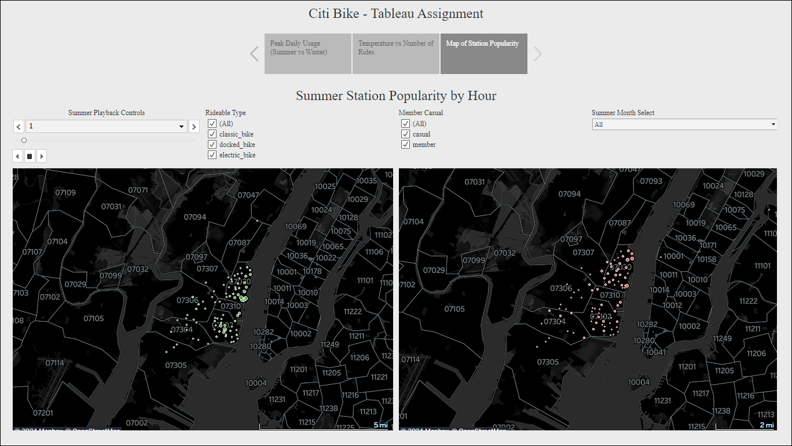

# citi_bike_tableau

## Table of Contents

1. [Tableau Public File](https://github.com/RJBarker/citi_bike_tableau#tableau-public-file)
2. [Scenario](https://github.com/RJBarker/citi_bike_tableau#scenario)
3. [Instructions](https://github.com/RJBarker/citi_bike_tableau#instructions)
4. [Data Retrieval](https://github.com/RJBarker/citi_bike_tableau#data-retrieval)
5. [Data Cleaning](https://github.com/RJBarker/citi_bike_tableau#data-cleaning)
6. [Data Analysis](https://github.com/RJBarker/citi_bike_tableau#data-analysis)
7. [References](https://github.com/RJBarker/citi_bike_tableau#references)

### Tableau Public File

[Ryan Barker - citi_bike_v3](https://public.tableau.com/views/citi_bike_v3/CitiBike_Analysis?:language=en-US&publish=yes&:display_count=n&:origin=viz_share_link)

------

### Scenario

Congratulations on your new job! As the new lead analyst for the [New York Citi Bike](https://en.wikipedia.org/wiki/Citi_Bike) program, you are now responsible for overseeing the largest bike-sharing program in the United States. In your new role, you will be expected to generate regular reports for city officials looking to publicize and improve the city program.

Since 2013, the Citi Bike program has implemented a robust infrastructure for collecting data on the program's utilization. Each month, bike data is collected, organized, and made public on the [Citi Bike Data](https://www.citibikenyc.com/system-data) webpage.

However, while the data has been regularly updated, the team has yet to implement a dashboard or sophisticated reporting process. City officials have questions about the program, so your first task on the job is to build a set of data reports to provide the answers.

------

### Instructions

Your task in this assignment is to aggregate the data found in the Citi Bike Trip History Logs and find two unexpected phenomena.

- Design 2–5 visualizations for each discovered phenomenon (4–10 total). You may work with a timespan of your choosing. Optionally, you can also merge multiple datasets from different periods.
- Use your visualizations (not necessarily all of them) to design a dashboard for each phenomenon. The dashboards should be accompanied by an analysis explaining why the phenomenon may be occurring.
- Create one of the following visualizations for city officials:
    - Basic: A static map that plots all bike stations with a visual indication of the most popular locations to start and end a journey, with zip code data overlaid on top.
    - Advanced: A dynamic map that shows how each station's popularity changes over time (by month and year). Again, with zip code data overlaid on the map.
    - The map you choose should also be accompanied by a write-up describing any trends that were noticed during your analysis.
- Create your final presentation:
    - Create a Tableau story that brings together the visualizations, requested maps, and dashboards.
    - Ensure your presentation is professional, logical, and visually appealing.

------

### Data Retrieval

#### Citi Bike

- I opted to retrieve data for Jersey City from the range of data available from the Citi Bike service
- I found that the datasets here were much more manageable in terms of size compared to the data for whole service
- My interest was to look at how the weather affects the service usage levels, particularly for the Summer and Winter months.
- For the summer months:
    - I obtained the data files for June, July and August
- For the winter months:
    - I obtained the data files for November, December and January

#### Weather Data

- As previously mentioned, I was keen to look at the trends which occur due to weather variances
- Some question's I wanted to look at:
    - How does peak usage hours compare between summer and winter months?
        - Do weekday usage vary greatly to weekend usage?
    - Does the temperature play a role on the number of rides occurring?
        - What temperature's saw the most usage in Summer?
        - How does that compare to the Winter?
    - Does the temperature cause average trip times to increase/decrease?
- To obtain the weather data for both Summer and Winter months, I used the API from [Open-Meteo.com](https://www.open-meteo.com/).
- This service offers historical hourly weather data, which was ideal for my analysis, among many other weather data services.
- My code to retrieve this data can be found:
    - Summer Months [Click Here](Data_Handling/Weather_Extract/summer_weather.ipynb)
    - Winter Months [Click Here](Data_Handling/Weather_Extract/winter_weather.ipynb)

------

### Data Cleaning

**Citi Bike**
- *Full Code Can be found Here: [Concat Notebook](Data_Handling/Concat_CSV_Files.ipynb)*
- The Citi Bike data is broken down by month, and as I was using six documents (three for summer and three for winter), I wanted to condense these down into just two seperate files.
- I created a for loop which looped through the Resources directory to obtain the filename month to determine if it was a Winter or Summer month
- 
- With this determined I created a DataFrame and added it to a list, either winter_dfs or summer_dfs.
- These lists would then be used with the `pandas.concat()` function to concatenate the DataFrames together.
- 
- To join the CitiBike data with the Weather data obtained from open-meteo.com, I created a helper column for the join. This would be the `started_at` column datetime converted to the format: "YYYY-MM-DD HH:00:00"
- 
- With this completed, the DataFrames were output to new CSV's within the `Outputs` directory
    - `summer_df.csv`
    - `winter_df.csv`
    - *Note: Due to the size of these files, they may not show within this GitHub repo*

 

**Open-Meteo.com Weather**
- *Full Code can be found here: [Weather Extract Folder](Data_Handling/Weather_Extract/)*
- I first obtained the `min` and `max` dates of the `started_at` column to idenitfy the date period required.
- 
- I then created a frequency DataFrame for each hour I required from the Open-Meteo service. This would be used in the API request
- 
- A request was then made with the results being passed into another DataFrame.
- 
- Additional mapping tasks were conducted on some of the values
- 
- Once completed, the DataFrame's were output as:
    - `summer_weather.csv`
    - `winter_weather.csv`

------

### Data Analysis

My Tableau Story is broken down into three pages:

- Peak Daily Usage
- Temperature vs Number of Rides
- Map of Station Popularity (Summer Months)

--------

#### Peak Daily Usage

**Analysis**

Weekday Analysis
- We can see from the heatmaps that both Summer and Winter months had peak usage hours between 7-8am and 5-6pm on weekdays. This can clearly be attributed to typical working hours and people commuting to work.

Weekend Analysis
- In contrast to the weekday usage, weekend's experience a much broader range of hours where usage peaks. During Summer months usage begins to increase from 8am with consistent demand through until 8pm before it begins trailing off. Winter's usage follows a similar trend over a shorter daily period possibly due to lesser daylight hours

--------

#### Temperature vs Number of Rides

**Analysis**

Temperature vs Rider Count Analysis

- Through the data obtained from Open-Meteo.com, and from the visuals provided, we can see that the temperature overall has a significant effect on the Citi Bike Service usage.

- Through the Summer months there is a clear uptake when temperatures hit around 20(c)+ peaking at 25(c) with a negative effect happening when temperatures reach 27(c)+.

- In Winter months, however, the peak occurred at around 6(c). This is inline with the average temperature for this time of year in Jersey City and we would expect more data points to occur within this temperature zone.

- Another key highlight is the split of usage between members and casual. In summer months the split is distributed 70%-30% in favour of the member category. During the winter, there is approx. a 5% shift to 75%-25%, again in favour of the members category.

- The winter is an ideal time for a preventative maintenance programme to be implemented to ensure bikes are in optimal condition ready for temperature and service usage increases.

--------

#### Map of Station Popularity

**Analysis**

Start Stations

- From the dynamic map we can see how the station usage increases at the peak times previously identified in the `Peak Daily Usage`
- The main Zip codes with the most activity are `07030` and `07302`
- The Zip code `07030` appears to be more of a residential area and would fit with the hypothesis that the peak hours primary contribution is through commuting to work.

End Stations

- The end stations follow the similar trend to the start stations, with peak hours occurring during commuting times.
- We can see that a small number of journey's venture out of Jersey City, and into other areas of New York.
- The vast majority of journey's occur within Jersey city and more predominatley between the zip codes `07030` and `07302`.
- This analysis shows that the Citi Bike service is a real benefit to both residents and tourists within Jersey City.

--------

## References

| Reference Name | Description |
|----------------|-------------|
| edX Boot Camps LLC | Course materials and assignment instructions |
| [Citi Bike NYC](https://citibikenyc.com/) | Citi Bike Trip Data |
| [Open-Meteo.com](https://www.open-meteo.com/) | Historical hourly weather data service |
| [Tableau](https://www.tableau.com/) | *"Tableau is a visual analytics platform transforming the way we use data to solve problems – empowering people and organisations to make the most of their data."* |
